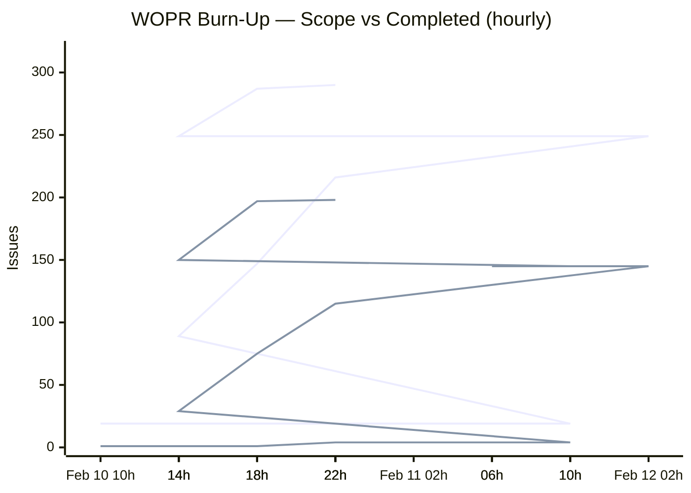
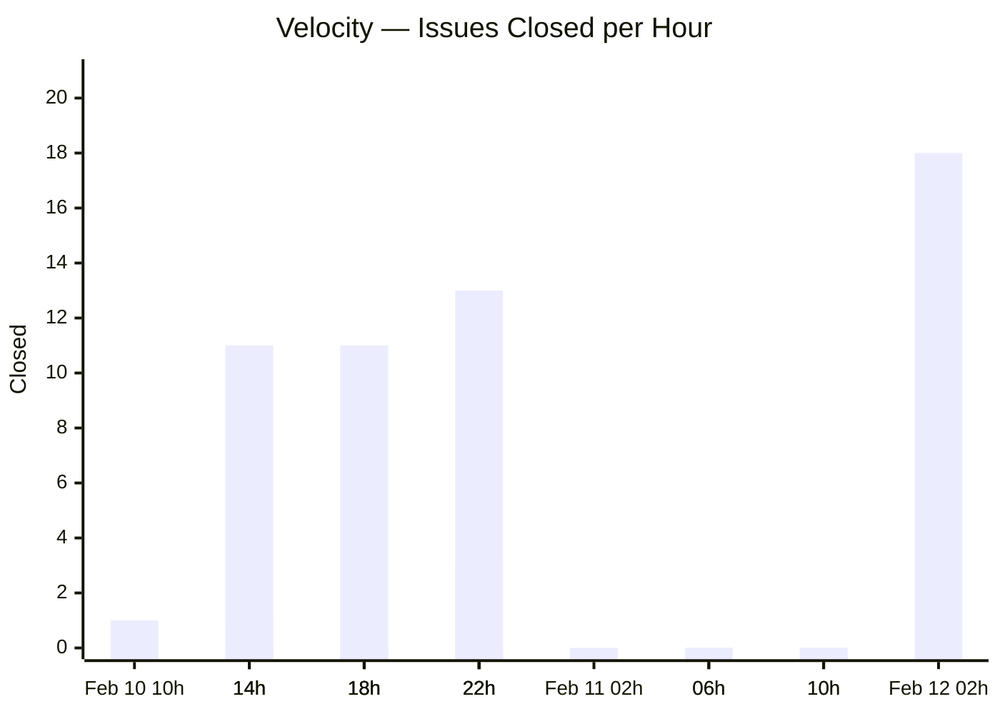
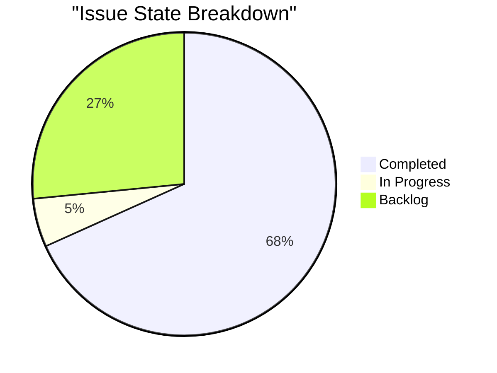
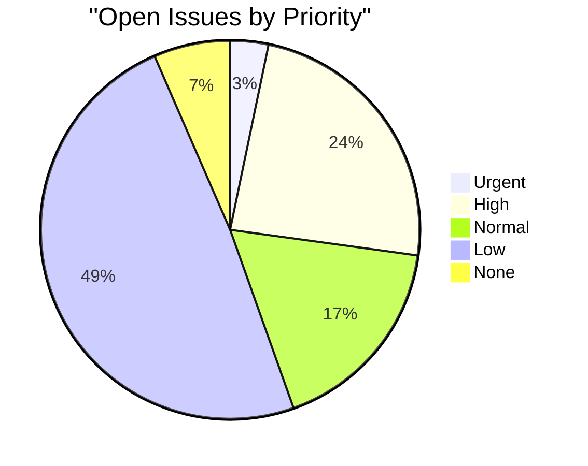

# WOPR Network

**AI-native multi-channel bot platform** — Discord, Slack, Telegram, WhatsApp, Signal, IRC, and more.

## Burn-Up Chart

> **Upper line** = total scope (issues created) | **Lower line** = completed | **Gap** = remaining work

## Milestone Progress

```mermaid
xychart-beta
  title "Milestone Progress"
  x-axis ["WebMCP Integration", "4. Dynamic Plugin UI", "6. Monetization", "5. P2P Network", "3. Platform Core", "Agent Tools", "Channel Expansion", "Continuous Delivery", "Security & Error Handling", "Code Quality", "Test Coverage", "Standalone WebUI", "Feature Completion", "2. Instance Hardening", "1. Plugin Types & Manifest"]
  y-axis "Issues" 0 --> 40
  bar [0, 0, 0, 0, 3, 2, 11, 31, 23, 31, 17, 22, 32, 4, 4]
  bar [17, 11, 1, 3, 30, 3, 11, 3, 2, 2, 0, 0, 0, 0, 0]
```

> **Dark bars** = completed | **Light bars** = remaining

## Velocity

## Progress by Repo

| Repo | Total | Done | Open | Progress |
|------|-------|------|------|----------|
| wopr | 31 | 12 | 19 | ▓▓▓▓░░░░░░ 39% |
| platform | 20 | 3 | 17 | ▓▓░░░░░░░░ 15% |
| other | 23 | 7 | 16 | ▓▓▓░░░░░░░ 30% |
| devops | 28 | 21 | 7 | ▓▓▓▓▓▓▓▓░░ 75% |
| security | 30 | 23 | 7 | ▓▓▓▓▓▓▓▓░░ 77% |
| infra | 7 | 3 | 4 | ▓▓▓▓░░░░░░ 43% |
| voice | 6 | 3 | 3 | ▓▓▓▓▓░░░░░ 50% |
| webui | 20 | 17 | 3 | ▓▓▓▓▓▓▓▓▓░ 85% |
| imessage | 3 | 1 | 2 | ▓▓▓░░░░░░░ 33% |
| memory-semantic | 5 | 3 | 2 | ▓▓▓▓▓▓░░░░ 60% |
| msteams | 7 | 5 | 2 | ▓▓▓▓▓▓▓░░░ 71% |
| refactor | 34 | 32 | 2 | ▓▓▓▓▓▓▓▓▓░ 94% |
| discord | 4 | 2 | 2 | ▓▓▓▓▓░░░░░ 50% |
| signal | 2 | 1 | 1 | ▓▓▓▓▓░░░░░ 50% |
| telegram | 11 | 10 | 1 | ▓▓▓▓▓▓▓▓▓░ 91% |
| whatsapp | 12 | 11 | 1 | ▓▓▓▓▓▓▓▓▓░ 92% |
| types | 7 | 6 | 1 | ▓▓▓▓▓▓▓▓▓░ 86% |
| github | 8 | 7 | 1 | ▓▓▓▓▓▓▓▓▓░ 88% |
| slack | 10 | 9 | 1 | ▓▓▓▓▓▓▓▓▓░ 90% |
| providers | 7 | 7 | 0 | ▓▓▓▓▓▓▓▓▓▓ 100% |
| webhooks | 1 | 1 | 0 | ▓▓▓▓▓▓▓▓▓▓ 100% |
| testing | 14 | 14 | 0 | ▓▓▓▓▓▓▓▓▓▓ 100% |
| **Total** | **290** | **198** | **92** | **68%** |

### Issue States

### Open by Priority

## Summary

| Metric | Count |
|--------|-------|
| Total Issues | 290 |
| Completed | 198 |
| In Progress | 15 |
| Backlog | 77 |
| Completion | 68% |

---

*Updated automatically every hour from [Linear](https://linear.app/wopr) — last run: 2026-02-13 06:06 UTC*
