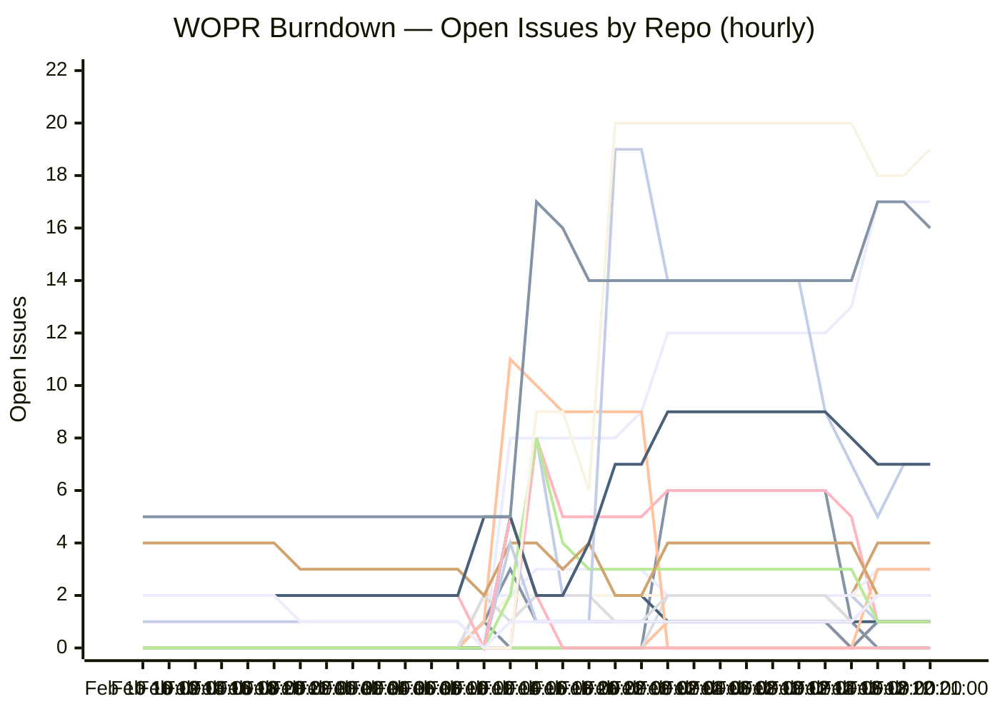

# WOPR Network

**AI-native multi-channel bot platform** — Discord, Slack, Telegram, WhatsApp, Signal, IRC, and more.

## Project Burndown

> Lines (top→bottom): platform, providers, signal, imessage, webhooks, infra, telegram, whatsapp, types, memory-semantic, voice, github, webui, msteams, slack, refactor, devops, testing, security, wopr, discord, other

### Current Open Issues by Repo

| Repo | Open Issues |
|------|------------|
| wopr | ██████████ 19 |
| platform | █████████ 17 |
| other | ████████ 16 |
| devops | ████ 7 |
| security | ████ 7 |
| infra | ██ 4 |
| voice | ██ 3 |
| webui | ██ 3 |
| imessage | █ 2 |
| memory-semantic | █ 2 |
| msteams | █ 2 |
| refactor | █ 2 |
| discord | █ 2 |
| signal | █ 1 |
| telegram | █ 1 |
| whatsapp | █ 1 |
| types | █ 1 |
| github | █ 1 |
| slack | █ 1 |
| **Total** | **92** |

### Summary

| Metric | Count |
|--------|-------|
| Total Issues | 290 |
| Done | 198 |
| In Progress | 15 |
| Backlog | 77 |
| Completion | 68% |

---

*Updated automatically every 6 hours from [Linear](https://linear.app/wopr) — last run: 2026-02-13 05:53 UTC*
